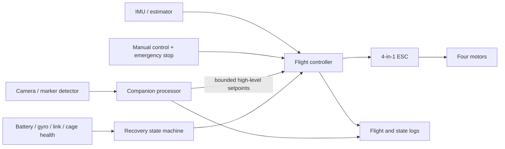
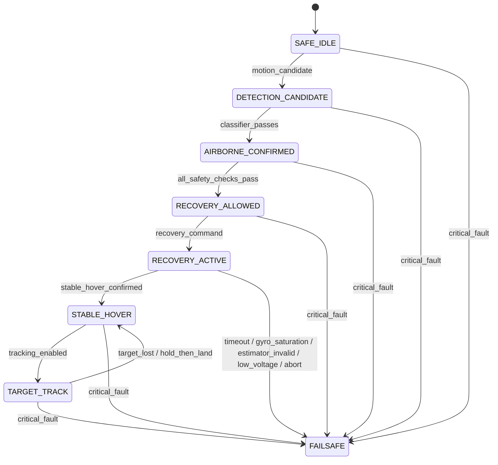

# Control Architecture and Recovery State Machine

The machine-readable source is [state_machine.json](state_machine.json). Any firmware implementation and diagram must preserve these state names and transition guards.

## Architecture

The companion processor never commands individual motors. Manual override and critical flight-controller failsafes take priority.

## Recovery State Machine

Every transition must log its trigger, evaluated guards, timeout, command, and reason.

## Estimator Envelope

- Initial angular rate must remain below 80% of the verified gyro measurement limit.
- Configured firmware gyro range must be verified against the IMU datasheet.
- Recovery is rejected on gyro saturation or invalid estimator health.
- External video or motion capture must validate onboard attitude estimates during controlled tests.
- No recovery claim is valid outside the tested estimator envelope.
