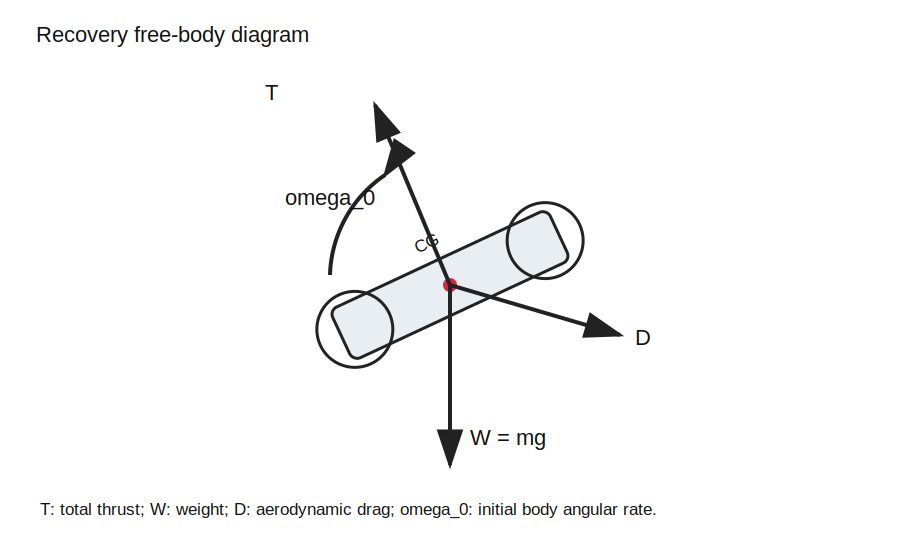
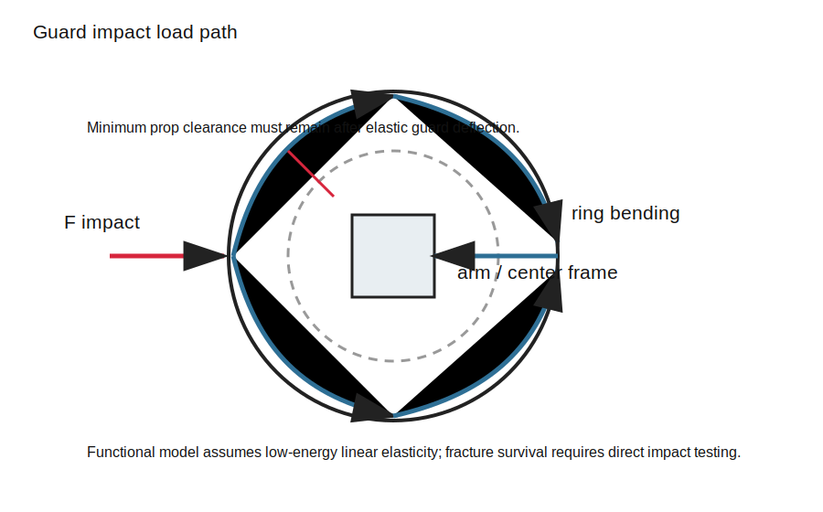

# Design Report: Protected Throwable Micro-UAV

## Summary

This report defines a small guarded quadcopter platform intended to learn, test, and document the path toward a throwable micro-UAV. The long-term dream is a drone that can be tossed, dropped, or released, detect the airborne event, stabilize in midair, and follow a designated target. The engineering path is staged so the dangerous behavior is delayed until the hardware, controls, sensor logging, and safety systems are proven.

The first complete build is not a full throw-and-chase drone. It is a protected test vehicle that can manually hover, track a marker slowly, log launch/drop events, and later attempt controlled release recovery inside a cage.

Reference video supplied with the project prompt: https://www.youtube.com/watch?v=J79zT6G878k

## Project Definition and Specifications

### Design Objective

Design a compact guarded micro-UAV that can eventually:

- detect a tossed, dropped, or released state using onboard inertial sensing
- reject unsafe activation conditions
- stabilize from a controlled release into hover
- follow a designated target, starting with a marker
- support future cooperative behavior with a "mother" drone or external positioning source

V1 objective:

> Build a guarded micro-quadcopter test platform that closes a sourced mass budget, manually hovers in a cage, tracks a defined marker, logs launch/drop events without automatic motor response, and prepares for controlled release recovery.

### Key Specifications

| Parameter | V1 Specification |
|---|---:|
| Vehicle type | guarded quadcopter |
| Aspirational target mass | 140 g |
| Provisional planning ceiling | 200 g |
| Mass freeze abort threshold | 225 g |
| Static thrust-to-weight | at least 2.0 |
| Propulsion voltage | 2S LiPo baseline |
| Prop size | 2.0-2.3 in baseline |
| Flight controller | ArduPilot-capable STM32 H7/F7 board |
| Vision target | ArUco, AprilTag, or large high-contrast marker |
| Live test environment | netted cage only |
| Launch detection | log-only in Stage 1 |
| Live recovery | controlled release in later stage |
| Full hand throw | not V1 |

### Requirement Compliance and Verification

| Requirement | Verification Method | V1 Pass Criteria |
|---|---|---|
| Mass limit | CAD/BOM rollup then scale measurement | worst case plus 5 g closes against frozen maximum |
| Thrust margin | measured thrust stand data | at least 2:1 thrust-to-weight at frozen maximum |
| Manual flight | cage hover test | 30 s hover without cage contact |
| Guard safety | bump and clearance test | no prop contact with guards after minor bump |
| Battery retention | shake and bump test | battery remains captured |
| Vibration quality | flight log review | IMU data usable at hover throttle |
| Marker tracking | cage tracking test | yaw-only centering before translation |
| Target loss response | blocked/removed marker test | hold, then land after timeout |
| Launch classifier | log dataset and confidence bounds | 95% false-positive upper bound at or below the phase requirement |
| Emergency response | bench and cage test | manual disarm/kill command works every time |

### Constraints and Engineering Considerations

- Mass creep is the main design threat. Every gram added to guards, mounts, camera, wiring, and battery reduces thrust margin.
- Prop guards are mandatory, but they must be stiff enough not to flex into the props.
- The battery should be removable and centrally retained for V1. Putting pouch cells inside hollow frame arms is a future packaging experiment, not the first safe build.
- The companion vision processor must only send bounded high-level commands. It must not command individual motors.
- Launch detection must be proven in logs before it is allowed to trigger a live recovery.
- General object following is not V1. The first target must be defined and measurable.
- A tri-copter is not selected for V1 because adding servo tilt increases mechanical and controls complexity. A quadcopter gives simpler control allocation and easier use of existing flight stacks.
- Recovery analysis must respect the verified gyro and estimator envelope. The simulator may not assume perfect state knowledge during high-rate motion.
- Powered release testing remains blocked until the instrumentation, containment, release-rig FMEA, and safety review gates pass.

### Applicable Standards and Regulations

This project is designed for indoor cage testing first. Outdoor operation must be checked against the current rules for the country and location of the test. The build is expected to happen in the United States, so FAA rules are the primary outdoor-flight reference.

United States FAA baseline:

- Recreational flyers must complete TRUST and carry proof when operating recreationally.
- FAA registration is required for drones above 0.55 lb, or 250 g, unless an exemption applies. The V1 target is below 250 g, but any heavier revision must be checked.
- Drones that are required to register, or that are registered, must comply with Remote ID unless flown under an allowed exception such as a FRIA.
- If the project is flown for non-recreational purposes, Part 107 requirements may apply.
- If testing outdoors in controlled airspace, airspace authorization may be required through LAANC or another FAA process.
- ArduPilot Throw Mode is treated as a reference, not a shortcut. Its own documentation describes throw mode as risky, requiring valid position information, and recommends normal takeoff whenever possible.
- PX4 Offboard Mode is treated as a reference for companion-computer control. PX4 requires continuous offboard signaling and defines failsafe behavior if that signal is lost.
- Mongolia and other locations may have separate unmanned-aircraft rules. Verify local civil aviation rules before any outdoor test outside the United States.

Reference links:

- ArduPilot Throw Mode: https://ardupilot.org/copter/docs/throw-mode.html
- PX4 Offboard Mode: https://docs.px4.io/main/en/flight_modes/offboard.html
- PX4 Safety/Failsafe Configuration: https://docs.px4.io/main/en/config/safety.html
- FAA Recreational Flyers: https://www.faa.gov/uas/recreational_flyers/
- FAA Drone Registration: https://www.faa.gov/uas/getting_started/register_drone/
- FAA Remote ID: https://www.faa.gov/uas/getting_started/remote_id/
- FAA Part 107 Remote Pilot: https://www.faa.gov/uas/commercial_operators/become_a_drone_pilot
- FAA LAANC: https://www.faa.gov/uas/getting_started/laanc
- Mongolian Civil Aviation Law reference: https://legalinfo.mn/mn/detail?lawId=16760186591361
- OpenMV AprilTag support: https://docs.openmv.io/

## Conceptual Design and Evaluation

### Concepts Considered

| Concept | Pros | Cons | Decision |
|---|---|---|---|
| Guarded quadcopter | simplest flight stack support, four fixed motors, good control authority | four motors and guards add mass | selected |
| Tri-copter with servo yaw | fewer motors | servo adds failure mode and control complexity | rejected for V1 |
| Coaxial quad/X8 micro | compact footprint | inefficient, more ESC/motor mass | rejected for V1 |
| Off-the-shelf whoop only | fastest to fly | weak mechanical portfolio value | rejected as final form |
| Custom guarded frame with proven electronics | strong learning and portfolio value | more CAD/testing effort | selected |

### Selected Concept Description

The selected concept is a 2S guarded quadcopter architecture with:

- four 1103-class brushless motors
- 2.0-2.3 in props
- modular circular prop guards
- central removable 2S LiPo battery
- ArduPilot-capable flight controller
- 4-in-1 ESC
- companion vision processor
- forward/downward camera mount for marker tracking
- external manual override and emergency disarm path

The first target-following mode uses a visible marker. The future "mother drone" concept should be treated as a later positioning-interface extension where the mother drone or an external beacon provides relative position setpoints.

## Development Section

### Requirements and Estimate Policy

Fixed requirements are stored in [requirements.csv](../Engineering%20Data/requirements.csv). Uncertain estimates are stored in [estimates.csv](../Engineering%20Data/estimates.csv) as best, nominal, and worst values with a basis and source.

| Constant or Requirement | Value |
|---|---:|
| Gravity | 9.81 m/s^2 |
| Aspirational target mass | 0.140 kg |
| Provisional planning ceiling | 0.200 kg |
| Mass freeze abort threshold | 0.225 kg |
| Required T/W minimum | 2.0 |
| Battery usable capacity | 80% of nominal |
| Prop diameter baseline | 2.0-2.3 in |
| Guard radial prop clearance | 2-3 mm |
| Stable-hover confirmation window | 3 s |
| Max horizontal tracking speed | 0.3 m/s |
| Max yaw rate in tracking | 30 deg/s |

### Governing Equations

Core sizing equations are maintained in [calculations.md](calculations.md). The main equations are:

- weight: `W = m g`
- total thrust-to-weight: `T/W = T_total / W`
- required thrust per motor: `T_motor = T_total / 4`
- hover thrust per motor: `T_hover_motor = m / 4`
- electrical power: `P = V I`
- estimated flight time: `t_min = 60 * C_usable / I_avg`
- prop guard inner diameter: `D_inner = D_prop + 2 c`
- prop guard outer diameter: `D_outer = D_inner + 2 t_wall`
- frozen maximum mass: `roundup_to_5g(Sigma worst + 5 g)`
- nominal mass margin: `frozen maximum - Sigma nominal`
- guard elastic deflection: `delta = sqrt(2 E_impact / k)`
- guard equivalent force: `F_eq = sqrt(2 E_impact k)`

### Parametric Analysis

| Mass | 2:1 Total Thrust Required | Per-Motor Required |
|---:|---:|---:|---:|
| 140 g | 280 g | 70 g |
| 180 g proposed maximum | 360 g | 90 g |
| 200 g provisional ceiling | 400 g | 100 g |
| 225 g abort threshold | 450 g | 112.5 g |

Static thrust is not the only propulsion driver. Final selection must also satisfy recovery torque, angular acceleration, altitude-loss, battery-voltage, and estimator-envelope requirements using measured data.

### Final Calculated Dimensions and Performance

Initial V1 geometry:

| Parameter | Starting Value |
|---|---:|
| Motor diagonal wheelbase | 90-100 mm |
| Prop diameter | 51-58 mm |
| Guard inner diameter | prop diameter + 4-6 mm |
| Guard wall thickness | 1.5-2.5 mm |
| Approximate outer footprint | 125-140 mm square envelope |
| Stack height target | 35-45 mm |
| Complete mass requirement | not frozen; current proposed value is 180 g |

Initial performance target:

| Metric | Target |
|---|---:|
| Peak thrust | at least 2.0 times frozen maximum mass; recovery case may require more |
| Hover throttle | below 55% preferred |
| Manual hover duration | 30 s minimum test requirement |
| Practical early flight time | 2-4 min expected |
| Marker tracking speed | 0.3 m/s max |
| Recovery test | controlled release; minimum successful height must be measured |

### Structural and Stability Checks

Required checks:

- prop tip clearance at rest and after minor guard loading
- guard ring deflection under finger press and cage bump
- battery retention under shake and bump
- motor-mount stiffness
- camera mount stiffness and viewing angle
- flight-controller vibration in logs
- CG location relative to motor center
- wiring strain relief
- CAD and experimentally checked mass properties: mass, CG, and inertia tensor
- functional guard deflection and elastic stress safety factors

The low-energy functional guard model uses:

```text
delta_impact = sqrt(2 E_impact / k)
F_equivalent = sqrt(2 E_impact k)
sigma_impact = c_sigma F_equivalent
```

The model does not establish fracture survival. Plasticity, layer separation, and high-rate failure require direct impact testing.

Vibration check:

- log motors off
- log low throttle with props on in cage
- log hover
- compare accelerometer and gyro noise across tests
- revise flight-controller mounting if vibration corrupts attitude estimation

### Hold and Emergency Lowering

The drone must never depend on the vision processor for basic survival.

Minimum behaviors:

- manual override always wins
- low battery triggers landing
- companion disconnect triggers hold or land
- target loss triggers hold, then land
- camera blocked triggers hold, then land
- excessive tilt/rate rejects recovery
- cage/test mode disabled blocks auto-spinup

For V1, "emergency lowering" means a commanded controlled landing or immediate disarm depending on altitude, test setup, and cage condition. The exact behavior must be configured and tested before live recovery trials.

## Instrumentation and Test Safety

The [instrumentation plan](../Instrumentation/README.md) defines the truth source, uncertainty, synchronization, and calibration method for every validation measurement. High-speed calibrated video is the baseline external trajectory truth source; onboard barometric or integrated IMU altitude is not sufficient by itself for sub-meter recovery measurements.

The [test safety plan](../Safety/README.md) and [FMEA](../Engineering%20Data/fmea.csv) are hard gates. No powered release testing is allowed until containment, abort controls, release-rig mitigations, estimator boundaries, and supervision requirements pass.





## CAD Assembly and Engineering Drawings

Required CAD package:

- top-level assembly
- guarded frame
- guard module detail
- motor mount detail
- battery bay/strap/retention feature
- camera mount
- flight-controller stack
- ESC/power wiring envelope
- CG marker
- exploded view
- simple manufacturing drawings

Battery-in-frame note:

- V1 should use a central removable battery bay.
- Hollow arms may route wires and reduce exposed cabling.
- Do not bury soft LiPo pouch cells inside impact-loaded arms in V1.
- A future hollow-frame battery concept would need thermal venting, crash protection, cell replacement access, insulation from fasteners, and a separate abuse-test plan.

## Manufacturing and Assembly Plan

Recommended V1 fabrication:

- 3D print guards and frame prototypes in PETG first.
- Move to nylon or reinforced filament if PETG flexes too much.
- Use threaded inserts or captive nuts only where repeated service is expected.
- Keep guards modular so damaged sections can be replaced.
- Route motor wires inside protected channels where possible.
- Keep the battery removable without tools.
- Keep flight controller USB access available.

Assembly order:

1. print frame and guards
2. inspect prop clearance
3. install motors
4. install ESC and flight controller stack
5. install receiver/manual control link
6. install battery retention
7. perform props-off electrical tests
8. add vision board and camera
9. perform cage hover tests
10. add marker tracking and logging

## Tolerance and Alignment Requirements

| Feature | Requirement |
|---|---:|
| Prop tip clearance | 2-3 mm minimum |
| Motor axis tilt | keep visibly square; target under 1-2 deg |
| Guard-to-prop concentricity | no prop rub after minor flex |
| Battery CG offset | as close to centerline as practical |
| Flight controller alignment | axes aligned with frame orientation |
| Camera mount angle | fixed and documented |
| Fastener retention | no loosening after hover vibration test |

## Bill of Materials

The working BOM is maintained in [BOM.md](BOM.md). The baseline is a 2S 1103-class guarded quad using an ArduPilot-capable flight controller and a marker-capable vision processor.

## Test Plan

### Stage 1 Tests

| Test | Purpose | Pass Criteria |
|---|---|---|
| mass rollup and measurement | verify packaging discipline | worst case plus 5 g closes against frozen maximum |
| thrust review | verify propulsion feasibility | measured static T/W at least 2.0 and recovery case passes |
| props-off motor test | prevent assembly error | correct motor order and direction |
| emergency stop test | verify safety control | disarm works repeatedly |
| cage hover | prove flight baseline | 30 s hover without cage contact |
| vibration log | protect control quality | IMU data usable |
| marker bench test | verify vision path | target detected in cage lighting |
| marker hover test | verify tracking path | yaw-only centering first |
| launch log test | verify classifier data | no live motor response |
| false-positive test | prevent unsafe arming | 95% upper bound at or below 1% |

### Later Recovery Tests

| Test | Purpose | Pass Criteria |
|---|---|---|
| hover disturbance | tune stabilization margin | returns to stable hover |
| fixture release | first live recovery input | recovery only when no-go checks pass |
| controlled-height release series | map recovery envelope | report success rate and minimum successful height |
| target after recovery | integrated behavior | only after tracking and recovery pass separately |

## Conclusions and Recommendations

This project is feasible if it is built as a staged learning platform. The first engineering priority is not the vision model or dramatic throw behavior; it is closing the mass/thrust/power budget and proving safe manual hover with clean IMU data.

Recommended immediate work:

1. Complete the mass, thrust, power, and cost spreadsheet.
2. Select real components and replace estimates with datasheet values.
3. CAD the complete guarded assembly and export mass, CG, and inertia.
4. Freeze the maximum mass using the defined rollup rule.
5. Measure thrust, current, RPM, and latency before final propulsion selection.
6. Build the cage and validate instrumentation before live hover testing.
7. Attempt powered controlled-release recovery only after every safety and verification gate passes.

The long-term dream remains valid, but the project should earn each capability with data.
