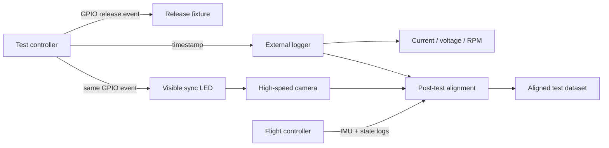

# Measurement and Instrumentation Plan

Analysis is only accepted when the measurement system can resolve the predicted difference. The authoritative register is [instrumentation.csv](../Engineering%20Data/instrumentation.csv).

## Dynamic-Test Synchronization



Synchronization requirements:

- one hardware event triggers release and the visible LED
- external logger records the same event
- vehicle logs record the event where hardware permits
- video aligns to the first illuminated frame
- sensor and synchronization uncertainty are reported separately

## Truth Sources

- High-speed calibrated video is the baseline trajectory and deflection truth source.
- Motion capture should be pursued through NYU for final recovery-envelope validation.
- Barometric altitude and integrated IMU position are not sole truth sources for sub-meter tests.
- CAD inertia must be checked using a bifilar or trifilar pendulum.
- Motor-start latency must use actual RPM or current onset, not command time.

## Calibration Records

Store calibration outputs under `Data/Calibration/` using:

```text
YYYY-MM-DD_instrument_calibration-name/
```

Each calibration record must state:

- instrument identifier
- reference standard
- procedure
- raw data
- fitted calibration
- residual/error estimate
- operator and date

## Measurement Readiness Gate

Before a test:

- instrument resolution is smaller than the expected design difference
- uncertainty is estimated
- synchronization path is verified
- cameras and scale/fiducials are fixed before arming
- file naming and test ID are assigned

If measurement uncertainty exceeds the expected design difference, improve the measurement system before drawing a conclusion.
