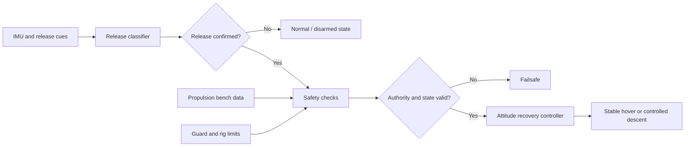
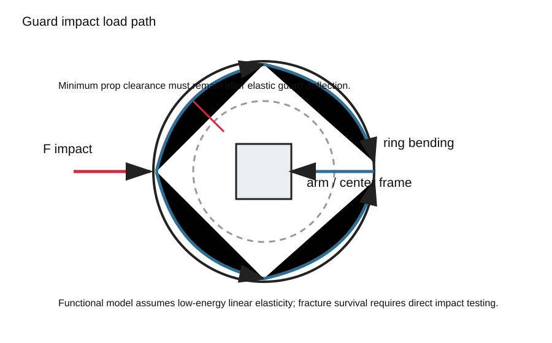
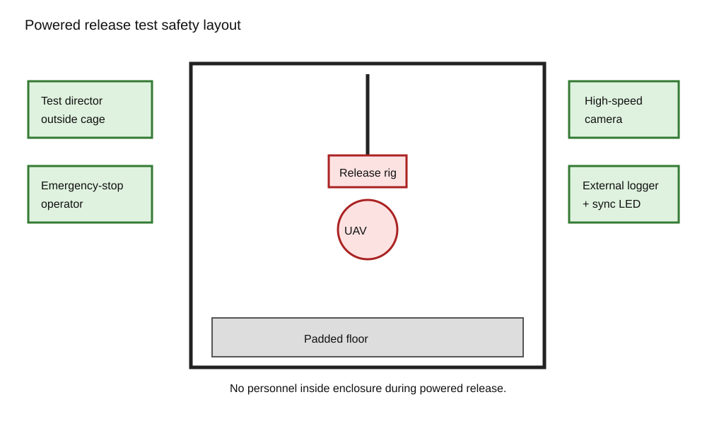

# Guarded Micro-UAV

[](https://github.com/500ft/SelfStabilizingDrone/actions/workflows/ci.yml)
[](https://www.python.org/)
[](LICENSE)

A staged engineering study of a protected micro-UAV that detects release and
attempts attitude recovery within measured propulsion, descent, sensing, and
guard-load limits.

**[Status](#project-status) · [Quick start](#quick-start) · [Recovery architecture](#recovery-architecture) · [Documentation](#documentation) · [Safety](#safety-boundary)**


*Simulated altitude loss and recoverable tumble-rate envelope for the current
component tiers. The current preregistered sweep uses placeholder torque until
the propulsion bench test is complete.*

## Overview

Midair recovery depends on more than a control loop. The vehicle must detect a
release, reject false triggers, produce enough torque at low battery voltage,
remain inside a descent budget, and keep its guard and release rig within load
limits. This repository turns those dependencies into explicit models, data
tables, test fixtures, and stop/go gates.

| | |
| --- | --- |
| **Project stage** | Stage 1 architecture and pre-purchase analysis |
| **Current simulation** | Release detection, rigid-body recovery, and Monte Carlo gates |
| **Hardware state** | Catalog selections recorded; hardware not yet purchased and weighed |
| **Physical testing** | Propulsion, guard, and recovery-flight tests pending |
| **Primary output** | Executable engineering plan with measured-authority gates |

## Project status

The current recovery sweep fails with placeholder torque authority. Progression
to the next test wave requires both measured propulsion authority and the fixed
primary simulation to pass:

| Gate | Requirement | State |
| --- | --- | --- |
| Low-voltage torque | Fifth-percentile authority at 7.0 V is at least `0.020 N·m` through 25–75% collective | Measurement pending |
| Recovery probability | At least 962 successes in 1,000 runs | Pending measured torque |
| Confidence bound | Exact one-sided 95% lower bound at least 0.95 | Pending measured torque |
| Descent budget | Maximum descent no greater than 3.0 m | Pending measured torque |
| Recovery flight | Bench gates and release-rig checks complete first | Not performed |

The deciding propulsion experiment is `EST-REC-007`. Its procedure and data
contract are frozen in the
[`measured-authority gate`](docs/specs/measured-authority-gate/design.md).

## Recovery architecture



The machine-readable state source is
[`Controls/state_machine.json`](Controls/state_machine.json). Firmware and
diagrams should preserve those state names and transition guards.

## Engineering visuals

| Guard load path | Release-rig safety layout |
| --- | --- |
|  |  |

Additional plots include the
[`recovery time histories`](Figures/release_recovery_timeseries.png) and the
free-body diagram in [`Figures/recovery-fbd.svg`](Figures/recovery-fbd.svg).

## Quick start

```bash
python -m venv .venv
source .venv/bin/activate
python -m pip install -r requirements.txt
python -m unittest discover -s Analysis/tests -v
python -m Analysis.run_release_recovery
```

The analysis entry points, inputs, and generated files are described in
[`Analysis/README.md`](Analysis/README.md).

## Documentation

### Design and execution

| Document | Purpose |
| --- | --- |
| [`Engineering Plan/README.md`](Engineering%20Plan/README.md) | Test sequence, dependencies, and exit gates |
| [`Design Report/README.md`](Design%20Report/README.md) | Architecture, BOM, and preliminary calculations |
| [`Analysis/current-results.md`](Analysis/current-results.md) | Current simulation outputs and gate state |
| [`Controls/README.md`](Controls/README.md) | State machine and control interfaces |
| [`Instrumentation/README.md`](Instrumentation/README.md) | Bench equipment and measurements |
| [`Safety/README.md`](Safety/README.md) | Release-rig plan and safety controls |

### Hardware and research

| Document | Purpose |
| --- | --- |
| [`Design Report/BOM.md`](Design%20Report/BOM.md) | Mass-tracked bill of materials |
| [`Engineering Plan/stage1-verification-gates.md`](Engineering%20Plan/stage1-verification-gates.md) | Stage 1 component and resource gates |
| [`Research/Component Study/README.md`](Research/Component%20Study/README.md) | Component and propulsion research index |
| [`Drone_Parts_Three_Tiers.pdf`](Drone_Parts_Three_Tiers.pdf) | Parts, mounting geometry, masses, and structural load cases |
| [`OPEN_QUESTIONS.md`](OPEN_QUESTIONS.md) | Decisions still requiring data or design work |
| [`ROADMAP.md`](ROADMAP.md) | Project phases and remaining milestones |

## Repository map

```text
Analysis/          executable models, gates, tests, and current results
Controls/          recovery state machine and controller interfaces
Design Report/     BOM, architecture, and calculations
Engineering Data/  requirements, budgets, interfaces, and FMEA tables
Engineering Plan/  staged execution plan and procurement sequence
Instrumentation/   bench procedures and measurement requirements
Safety/            release-rig and operating controls
Figures/           generated plots and engineering diagrams
Research/          component, propulsion, and architecture studies
```

## Safety boundary

No recovery flight should be attempted from the current repository state.
Bench propulsion data, guard testing, release-rig checks, and the registered
simulation gates must be completed first. See the
[`propulsion-bench checklist`](Instrumentation/propulsion-bench-safety-checklist.md)
and [`Safety/README.md`](Safety/README.md).

## Contributing

See [`CONTRIBUTING.md`](CONTRIBUTING.md) for analysis checks, generated-artifact
rules, and safety constraints.

## License

This project is available under the [MIT License](LICENSE).
