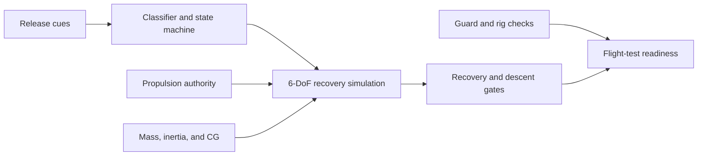

# Guarded Micro-UAV

[](https://github.com/500ft/SelfStabilizingDrone/actions/workflows/ci.yml)
[](https://www.python.org/)
[](LICENSE)

An engineering study of a protected micro-UAV that detects release and attempts
attitude recovery within propulsion, descent, sensing, and guard-load limits.

**[Results](Analysis/current-results.md) · [Reproduce](#reproduce-the-analysis) · [Data and figures](docs/data-and-figures.md) · [Safety](#safety-boundary)**


*Simulated altitude loss and recoverable tumble rate for three component tiers.
The [results](Analysis/current-results.md) explain the current gate state; the
[figure guide](docs/data-and-figures.md) records assumptions and generators.*

## Overview

Midair recovery requires the release classifier, controller, propulsion system,
battery, mass properties, guard, and test rig to close as one system. This
repository expresses those dependencies as executable models, structured data
tables, test contracts, and staged stop/go gates.



The current plots use estimated or catalog-derived parameters. The Monte Carlo
study compares placeholder torque with an assumed mixer-authority model.
Hardware has not yet supplied the measured authority, mass properties, guard
response, or recovery-flight data needed to close the registered gates.

## Reproduce the analysis

```bash
python -m venv .venv
source .venv/bin/activate
python -m pip install -r requirements.txt
python -m unittest discover -s Analysis/tests -v
python -m Analysis.run_release_recovery
python -m Analysis.monte_carlo_recovery
```

The first analysis command regenerates the recovery JSON and four plot files.
The second regenerates the deterministic Monte Carlo JSON. Other calculators
and their inputs are indexed in [`Analysis/README.md`](Analysis/README.md); the
complete data path is in [`docs/data-and-figures.md`](docs/data-and-figures.md).

## Documentation

| Document | Purpose |
| --- | --- |
| [`Analysis/current-results.md`](Analysis/current-results.md) | Current mass, guard, recovery, Monte Carlo, and gate results |
| [`docs/data-and-figures.md`](docs/data-and-figures.md) | Data sources, assumptions, plot generators, and reproduction limits |
| [`docs/figure-manifest.json`](docs/figure-manifest.json) | Machine-readable generator/input/output map |
| [`Engineering Plan/README.md`](Engineering%20Plan/README.md) | Test sequence, dependencies, and exit gates |
| [`Design Report/README.md`](Design%20Report/README.md) | Architecture, BOM, and preliminary calculations |
| [`Controls/README.md`](Controls/README.md) | State machine and control interfaces |
| [`Instrumentation/README.md`](Instrumentation/README.md) | Bench equipment and measurement procedures |
| [`Safety/README.md`](Safety/README.md) | Release-rig plan and operating controls |
| [`docs/specs/measured-authority-gate/`](docs/specs/measured-authority-gate/) | Registered propulsion and recovery acceptance contract |
| [`ROADMAP.md`](ROADMAP.md) | Project phases and remaining milestones |

The authoritative controller state names and guards are stored in
[`Controls/state_machine.json`](Controls/state_machine.json).

## Repository map

```text
Analysis/          executable models, gates, tests, and result summary
Controls/          recovery state machine and controller interfaces
Data/              generated JSON plus the structure for future test data
Design Report/     BOM, architecture, and calculations
Engineering Data/  requirements, budgets, interfaces, and FMEA tables
Engineering Plan/  staged execution and procurement plan
Instrumentation/   bench procedures and measurement requirements
Safety/            release-rig and operating controls
Figures/           generated plots and authored engineering diagrams
Research/          component, propulsion, and architecture studies
docs/              specifications and figure lineage
```

## Safety boundary

Do not attempt a recovery flight from the current project state. Propulsion
measurements, guard testing, release-rig checks, and the registered simulation
gates must be completed first. See the
[`propulsion-bench checklist`](Instrumentation/propulsion-bench-safety-checklist.md)
and [`Safety/README.md`](Safety/README.md).

See [`CONTRIBUTING.md`](CONTRIBUTING.md) for analysis checks, generated-artifact
rules, and safety constraints. The project uses the [MIT License](LICENSE).
