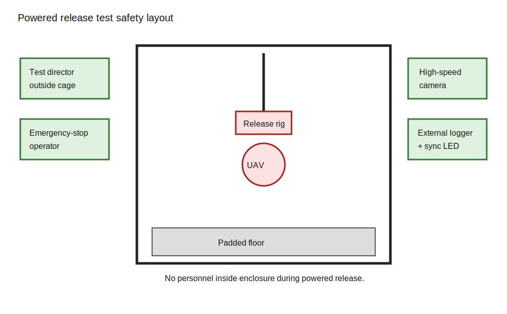

# Test Safety and Release-Rig Plan

No powered release testing is authorized by this repository. It remains blocked until the physical setup and all safety gates are reviewed and approved.

The authoritative hazard register is [fmea.csv](../Engineering%20Data/fmea.csv).

## Powered-Release Gate

All items must pass:

- reliable manual hover
- verified primary and independent secondary disarm
- completed netted enclosure and padded floor
- release fixture reviewed and tested without props
- classifier and state-machine gates passed
- gyro and estimator envelope verified
- battery, motor, and ESC temperature limits defined
- written procedure and abort authority assigned
- faculty or laboratory approval obtained where required

## Test Roles

- **Test director:** owns the procedure and decides whether the test proceeds.
- **Emergency-stop operator:** watches only the vehicle and owns the disarm controls.
- **Instrumentation operator:** confirms recording, synchronization, and test ID.
- **Safety observer:** confirms enclosure, personnel clearance, and fire-response readiness.

One person may fill multiple roles only for unpowered testing. Powered release requires a separate emergency-stop operator.

## Test Controls

- no personnel inside the enclosure during powered release
- eye protection for everyone present
- external manual disarm controls
- preflight and postflight checklists
- battery quarantine container and fire-response procedure
- maximum consecutive-test count and cooldown interval
- cameras and instruments installed before arming
- disarm before approaching any failed or hung release

## Pre-Test Checklist

- [ ] Test ID assigned
- [ ] FMEA controls reviewed
- [ ] Enclosure and padded floor inspected
- [ ] Release fixture safety pin installed
- [ ] Primary and secondary disarm verified
- [ ] Battery inspected and voltage acceptable
- [ ] Motor, ESC, and battery temperatures acceptable
- [ ] Instrumentation recording and sync LED verified
- [ ] Personnel outside enclosure
- [ ] Abort authority confirmed

## Post-Test Checklist

- [ ] Vehicle disarmed and zero RPM confirmed
- [ ] Battery removed and inspected
- [ ] Guard, frame, props, and fixture inspected
- [ ] Temperatures recorded
- [ ] Test result and failure mode recorded
- [ ] Data files verified before next test

## Release-Rig Safety Layout

